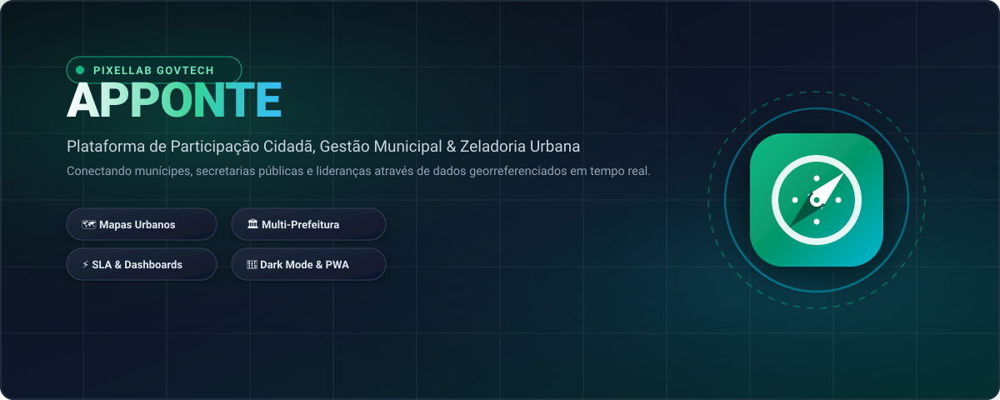

# APPonte — Plataforma de Participação Cidadã, Rede Social e SaaS Multi-tenant

<div align="center">

<p align="center">
  
</p>

[](https://www.typescriptlang.org/)
[](https://reactjs.org/)
[](https://nestjs.com/)
[](https://www.mongodb.com/)
[](https://www.docker.com/)
[](https://opensource.org/licenses/MIT)

**Uma ponte digital moderna e transparente conectando cidadãos, secretarias municipais e gestão pública.**  
*Desenvolvido por **PixelLab GovTech Solutions***

[Demonstração](#-credenciais-de-demonstração-seed) • [Arquitetura](#-arquitetura-do-sistema) • [Como Executar](#-como-executar-o-projeto) • [Swagger API](#-documentação-da-api-swagger) • [Módulos](#-módulos-e-funcionalidades)

</div>

---

## 🏛️ Visão Geral do Produto

O **APPonte** é uma plataforma cívica full-stack e SaaS multi-tenant onde moradores podem relatar problemas urbanos (buracos na via, iluminação pública, poda de árvores, sinalização), acompanhar a execução dos reparos em tempo real com fotos comprobatórias, interagir através de comentários e apoios (upvotes), e navegar em um mapa interativo georreferenciado via OpenStreetMap.

Para prefeituras e secretarias, a plataforma oferece painéis executivos com controle de SLAs, filas de atendimento para equipes em campo, relatórios analíticos e canais diretos de comunicação com a comunidade.

---

## 🛠️ Stack Tecnológica

| Camada | Tecnologias Utilizadas |
| :--- | :--- |
| **Front-end** | React 18, TypeScript, Vite, Tailwind CSS, Dark Mode, React Router, TanStack Query, React Hook Form, Zod, Axios, Lucide React, Leaflet & React-Leaflet (OpenStreetMap & CartoDB), Vitest. |
| **Back-end** | Node.js, TypeScript, NestJS 10, MongoDB, Mongoose (Índices `2dsphere` GeoJSON), Passport JWT & Refresh Token, Swagger / OpenAPI, Multer, Class-Validator, Throttler, Helmet. |
| **Infraestrutura** | Docker, Docker Compose, Nginx (Reverse Proxy & Load Balancer), Volumes Persistentes, Health Checks. |

---

## 🚀 Credenciais de Demonstração (Seed)

O banco de dados de desenvolvimento vem pré-configurado com contas para todos os perfis RBAC:

| Perfil | Município | E-mail de Acesso | Senha Padrão | Responsabilidades / Acessos |
| :--- | :--- | :--- | :--- | :--- |
| 👑 **Super Admin** | *Global (PixelLab)* | `superadmin@apponte.com` | `admin123` | Acesso global, gestão de prefeituras, planos SaaS e métricas. |
| 🏛️ **Admin Tenant** | Guaratinguetá - SP | `admin.guaratingueta@apponte.com` | `admin123` | Gestão da prefeitura, secretarias, categorias e anúncios locais. |
| 👔 **Secretário** | Guaratinguetá - SP | `secretario.obras@guaratingueta.sp.gov.br` | `admin123` | Dashboard analítico da pasta, SLAs, indicadores e alocação de equipe. |
| 👷 **Atuante (Operador)** | Guaratinguetá - SP | `operador.obras@guaratingueta.sp.gov.br` | `admin123` | Fila de atendimento, alteração de status e fotos comprobatórias. |
| 👥 **Cidadão Ativo** | Guaratinguetá - SP | `cidadao.guara@apponte.com` | `cidadao123` | Abertura de chamados com GPS, fotos, comentários e apoios. |
| 🏛️ **Admin Tenant** | Nova Esperança - SP | `admin.novaesperanca@apponte.com` | `admin123` | Gestão da prefeitura modelo. |
| 👥 **Cidadã** | Nova Esperança - SP | `maria.cidada@apponte.com` | `cidadao123` | Interação cívica comunitária no feed e mapa. |

---

## 💻 Como Executar o Projeto

### Opção 1: Via Docker Compose (Recomendado)

1. Clone o repositório e crie o arquivo de variáveis de ambiente:
   ```bash
   cp .env.example .env
   ```

2. Suba todos os contêineres (*Nginx, Backend, Frontend e MongoDB*):
   ```bash
   docker-compose up --build
   ```

3. Acesse a aplicação:
   - **Frontend Web**: [http://localhost](http://localhost) (ou [http://localhost:5173](http://localhost:5173))
   - **API REST**: [http://localhost/api](http://localhost/api) (ou [http://localhost:3001/api](http://localhost:3001/api))
   - **Swagger OpenAPI**: [http://localhost/api/docs](http://localhost/api/docs) (ou [http://localhost:3001/api/docs](http://localhost:3001/api/docs))

---

### Opção 2: Execução Local (Desenvolvimento)

#### Pré-requisitos
- Node.js 20+
- MongoDB rodando localmente na porta 27017

#### 1. Back-end (NestJS)
```bash
cd backend
npm install
npm run seed      # Popula o banco com planos, prefeituras, usuários e chamados
npm run start:dev # Inicia a API na porta 3000
```

#### 2. Front-end (React + Vite)
```bash
cd frontend
npm install
npm run dev       # Inicia o Vite na porta 5173
```

---

## 🧪 Executando os Testes Automatizados

### Testes do Back-end (Jest)
```bash
cd backend
npm run test
```

### Testes do Front-end (Vitest)
```bash
cd frontend
npm run test
```

---

## 📚 Documentação da API (Swagger)

A documentação interativa OpenAPI está disponível em `/api/docs`:
- **Auth**: `/api/auth/register`, `/api/auth/login`, `/api/auth/refresh`, `/api/auth/me`
- **Solicitações**: `/api/requests`, `/api/requests/map`, `/api/requests/:id/status`
- **Apoios & Comentários**: `/api/request-supports/:id/toggle`, `/api/request-comments`
- **Anúncios SaaS**: `/api/advertisements/serve`, `/api/advertisements/:id/click`
- **Dashboards**: `/api/dashboard/citizen`, `/api/dashboard/operator`, `/api/dashboard/secretary`, `/api/dashboard/admin`
- **Multi-tenancy**: `/api/tenants`, `/api/departments`, `/api/request-categories`

---

## 🔒 Matriz de Autorização (RBAC)

- **Público**: Navegação no Feed, Mapa, Landing e visualização de anúncios.
- **Cidadão**: Abertura de ocorrências com geolocalização e fotos, apoio comunitário, comentários públicos.
- **Atuante**: Fila de execução, transição de status para *Em Atendimento* e resolução com fotos comprobatórias obrigatórias.
- **Secretário**: Visualização de KPIs da pasta, distribuição de demandas por categoria/bairro e acompanhamento de equipe.
- **Administrador**: Gestão completa da prefeitura, secretarias, categorias, anúncios publicitários e usuários.
- **SuperAdmin**: Gestão multi-tenant global, planos SaaS e métricas gerais do sistema.

---

## 📄 Licença

Distribuído sob a licença MIT. Consulte `LICENSE` para obter mais informações.
